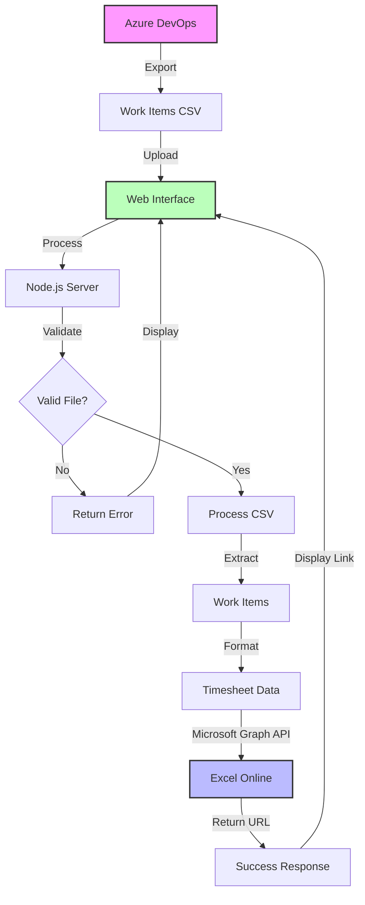

# Timesheet Automation App

A Node.js and React application that automates timesheet management by processing Azure DevOps work items and updating Excel Online timesheets using Microsoft Graph API.


## 🌟 Features

- 📊 Upload and process Azure DevOps work items from CSV
- 📅 Automatically populate timesheets in Excel Online
- 🔄 Real-time progress tracking
- 🎯 Direct link to updated Excel file
- 🛡️ Built-in error handling and validation
- 🎨 Modern, responsive UI with Tailwind CSS

## 🚀 Quick Start

### Prerequisites

- Node.js (v14 or higher)
- npm or yarn
- Microsoft 365 account with Excel Online access
- Azure AD app registration with appropriate permissions
- Azure DevOps project access

### Installation

1. Clone the repository:

```bash
git clone https://github.com/yourusername/timesheet-automation.git
cd timesheet-automation
```

2. Install dependencies:

```bash
npm install
```

3. Create environment variables:

```bash
cp .env.example .env
```

4. Update `.env` with your credentials:

```plaintext
# Application Configuration
PORT=3000
NODE_ENV=development

# Microsoft Graph API Configuration
CLIENT_ID=your_client_id_here
CLIENT_SECRET=your_client_secret_here
TENANT_ID=your_tenant_id_here

# Excel Online Configuration
WORKBOOK_ID=your_workbook_id_here
EXCEL_BASE_URL=https://your-tenant.sharepoint.com/sites/your-site
```

5. Build the React app:

```bash
npm run build
```

6. Start the server:

```bash
npm run server
```

The application will be available at `http://localhost:3000`

## 📋 Azure AD Setup

1. Register a new application in Azure AD Portal
2. Add required permissions:
   - Microsoft Graph API
     - Files.ReadWrite.All
     - Sites.ReadWrite.All
3. Generate a client secret
4. Note down:
   - Client ID
   - Client Secret
   - Tenant ID

## 📊 Excel Online Setup

1. Create a timesheet template in Excel Online
2. Share the workbook with appropriate permissions
3. Get the workbook ID from the URL
4. Update the `.env` file with the workbook details

## 🔄 Usage

1. Export work items from Azure DevOps as CSV
2. Upload the CSV file using the web interface
3. Monitor the upload progress
4. Click the provided link to view the updated timesheet

### CSV Format Requirements

The CSV file should include the following columns:

```csv
Work Item Type,ID,Title,Assigned To,State,Area Path,Tags,Changed Date
```

## 🛠️ Development

### Project Structure

```
timesheet-automation/
├── src/
│   ├── components/
│   │   └── TimesheetUploader.js
│   ├── utils/
│   │   └── graphService.js
│   ├── server.js
│   └── index.js
├── public/
├── build/
└── uploads/
```

### Available Scripts

- `npm start` - Start development server
- `npm run build` - Build production React app
- `npm run server` - Start production server
- `npm run dev` - Start development environment

## 🔒 Security

- Uses environment variables for sensitive data
- Implements file type validation
- Includes error handling
- Validates Azure AD tokens
- Implements secure file upload handling

## 🤝 Contributing

1. Fork the repository
2. Create your feature branch (`git checkout -b feature/AmazingFeature`)
3. Commit your changes (`git commit -m 'Add some AmazingFeature'`)
4. Push to the branch (`git push origin feature/AmazingFeature`)
5. Open a Pull Request

## 🔄 Workflow



## 📚 API Documentation

### Endpoints

#### File Upload

```http
POST /api/upload
```

**Request**

- Content-Type: `multipart/form-data`
- Body:
  - `workItems`: CSV file

```javascript
// Example using fetch
const formData = new FormData();
formData.append('workItems', csvFile);

fetch('/api/upload', {
  method: 'POST',
  body: formData
})
.then(response => response.json())
.then(data => console.log(data));
```

**Response**

```json
{
  "success": true,
  "message": "File uploaded successfully",
  "excelUrl": "https://example.com/your-excel-file"
}
```

**Error Response**

```json
{
  "error": "Error message description",
  "code": "ERROR_CODE"
}
```

### Error Codes

| Code               | Description                 |
| ------------------ | --------------------------- |
| FILE_NOT_FOUND     | No file uploaded            |
| INVALID_FORMAT     | Invalid CSV format          |
| PROCESSING_ERROR   | Error processing work items |
| AUTH_ERROR         | Authentication error        |
| EXCEL_UPDATE_ERROR | Error updating Excel file   |

### CSV Format Specification

Required columns in the CSV file:

| Column Name    | Description        | Example                 |
| -------------- | ------------------ | ----------------------- |
| Work Item Type | Type of work item  | Task, Bug, User Story   |
| ID             | Unique identifier  | 12345                   |
| Title          | Work item title    | Implement login feature |
| Assigned To    | Owner of the task  | user@example.com        |
| State          | Current status     | Active, Resolved        |
| Area Path      | Project area       | Project\SubArea         |
| Tags           | Associated tags    | frontend, urgent        |
| Changed Date   | Last modified date | 2024-01-01              |

### Environment Variables

```plaintext
# Required environment variables
CLIENT_ID=           # Azure AD Client ID
CLIENT_SECRET=       # Azure AD Client Secret
TENANT_ID=          # Azure AD Tenant ID
WORKBOOK_ID=        # Excel Online Workbook ID
EXCEL_BASE_URL=     # SharePoint/OneDrive base URL
```

### Timesheet Data Structure

Excel worksheet format:

| Column      | Type   | Description                     |
| ----------- | ------ | ------------------------------- |
| Date        | Date   | Work date (YYYY-MM-DD)          |
| Time In     | Time   | Start time (HH:mm)              |
| Time Out    | Time   | End time (HH:mm)                |
| Total Hours | Number | Calculated work hours           |
| Deliverable | Text   | Work item details (#ID - Title) |

### Rate Limits

- Maximum file size: 5MB
- Rate limit: 100 requests per hour
- Maximum rows per upload: 1000

### Authentication

The application uses Azure AD authentication. Ensure your Azure AD application has the following permissions:

- Microsoft Graph API
  - Files.ReadWrite.All
  - Sites.ReadWrite.All

Example authentication header:

```http
Authorization: Bearer {access_token}
```

### WebSocket Events

Real-time progress updates are sent through WebSocket:

```javascript
// Client-side WebSocket connection
const ws = new WebSocket('ws://localhost:3000');

ws.onmessage = (event) => {
  const data = JSON.parse(event.data);
  console.log('Progress:', data.progress);
};
```

| Event               | Description              |
| ------------------- | ------------------------ |
| upload_start        | File upload initiated    |
| processing_progress | CSV processing progress  |
| excel_update        | Excel file update status |
| completion          | Process completed        |

### Status Codes

| Status Code | Description           |
| ----------- | --------------------- |
| 200         | Success               |
| 400         | Bad Request           |
| 401         | Unauthorized          |
| 403         | Forbidden             |
| 404         | Not Found             |
| 413         | Payload Too Large     |
| 422         | Unprocessable Entity  |
| 429         | Too Many Requests     |
| 500         | Internal Server Error |

## 📝 TODO

- [ ] Add user authentication
- [ ] Implement file preview
- [ ] Add support for different timesheet templates
- [ ] Add email notifications
- [ ] Implement batch processing

## 📜 License

This project is licensed under the MIT License - see the [LICENSE](LICENSE) file for details.

## 🙏 Acknowledgments

- Microsoft Graph API Documentation
- React Documentation
- Tailwind CSS
- Express.js

## 🤝 Support

For support, email your.email@example.com or open an issue in the repository.

## 🔄 Version History

- 0.1.0
  - Initial Release
  - Basic file upload functionality
  - Excel Online integration
